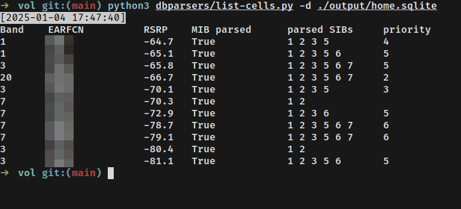
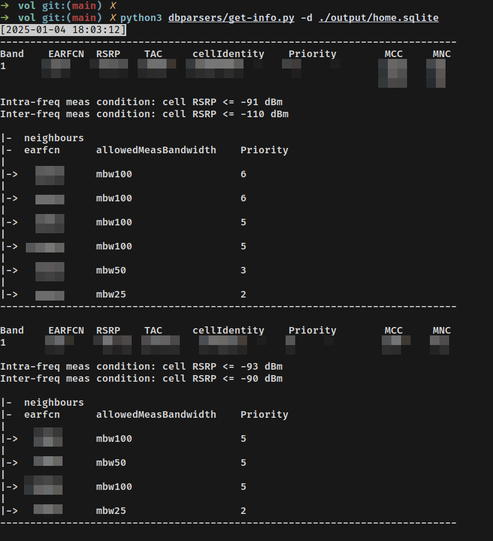

## lte searcher LTE and MIB/SIB parser

A combination of cell_search and srsue with disabled tx, which allows to parse MIBs and SIBs.

logic:
- cell_search
- if a cell found, remember where cell_search stopped
- launch srsue for found cell, try parse SIBs with specified timeout
- if SIB5 found, launch srsue for all neighboring EARFCN's from it. Then recursively to the previous step
- when there are no stations left from SIB5, continue the cell_search search from the place where it was stopped
- all MIBs/SIBs are stored into sqlite

## launch

- docker compose build
- put sdr
- ./run.sh
- ./sib-scan.sh -h

Tested on linux with Limesdr mini and Limesdr USB (via soapy). Should work with usrp and bladerf since srsRAN support them.

```bash
./sib-scan.sh -h
usage: sib-scan.sh [OPTION]...
  -h      show this help message
  -d      device name (UHD,soapy,bladeRF)
  -a      device args (example: "rxant=LNAW")
  -g      rx gain (default: 30)
  -b      lte band
  -s      start earfcn
  -e      end earfcn
  -q      use explict list of earfcn's (avoid cell_search)
          example: -q "1300 1301 1302 1303"
  -n      no reqursive scan, do no scan cells from sib5
  -t      srsue sib parsing timeout
          (default: 30)
  -T      additional timeout for srsue
          this value will be added per each successfully decoded sib
          (default: 30)
  -D      sqlite database to save results
          (default: /vol/output/cells.sqlite)

  Usage examples
  1
  Scan full band, parse SIBs from cells, also parse SIB's from cells that
  are found on SIB5, do search and parse neighboors from SIB5 reqursively:
  ./sib-scan.sh -b 3

  2
  Do the same, but not for full band:
  ./sib-scan.sh -b 3 -s 1300 -e 1400
  ./sib-scan.sh -s 1300 -e 1400       # will automatically determine band
  ./sib-scan.sh -s 1300               # will automatically determine band
                                      # and end-earfcn
  ./sib-scan.sh -e 1400               # will automatically determine band
                                      # and start-earfcn

  3
  Scan explict list of earfcn's, also reqursively scan neighboors from SIB5:
  ./sib-scan.sh -q "1300 1301 1302 1303"

  4
  Add device name and device args:
  ./sib-scan.sh -d soapy -a rxant=LNAW -b 3

  5
  Use another sqlite path:
  ./sib-scan.sh -b 3 -d /tmp/myoutput.sqlite
```

### LimeSDR usage

For limesdr devices consider use `-d soapy` option to avoid long search of UHD devices
Example:
```bash
./sib-scan.sh -d soapy -a "rxant=LNAW" -b 3
```

### usrp clones usage

Place the custom firmware in ./vol/helpers/uhd_images folder and give it an appropriate name, such as usrp_b210_fpga.bin. It will be automatically placed in the /usr/share/uhd/images/ folder inside the container. It's useful for devices such as USRP B210 LibreSDR clones.


## usage example

connect SDR and exec into container:
```bash
./run.sh
```

scan band 7 with limesdr:
```bash
./sib-scan.sh -d soapy -a "rxant=LNAH" -b 7 -d /vol/output/place1_band7.sqlite
```

parse data with dbhelper scripts:
```bash
cd ./vol
python3 dbparsers/list-cells.py -d ./output/place1.sqlite # show basic info for all scanned earfcn's
```


```bash
python3 dbparsers/get-info.py -d ./output/place1.sqlite # for each earfcn show SIB3/SIB5 info
```


rescan arfcn's that already parsed:
```
./run.sh
python3 dbparsers/get-arfcns.py -d ./output/place1.sqlite
./sib-scan.sh -d soapy -a "rxant=LNAW" -g 40 -q "1234 1235 1236 ..."
```
